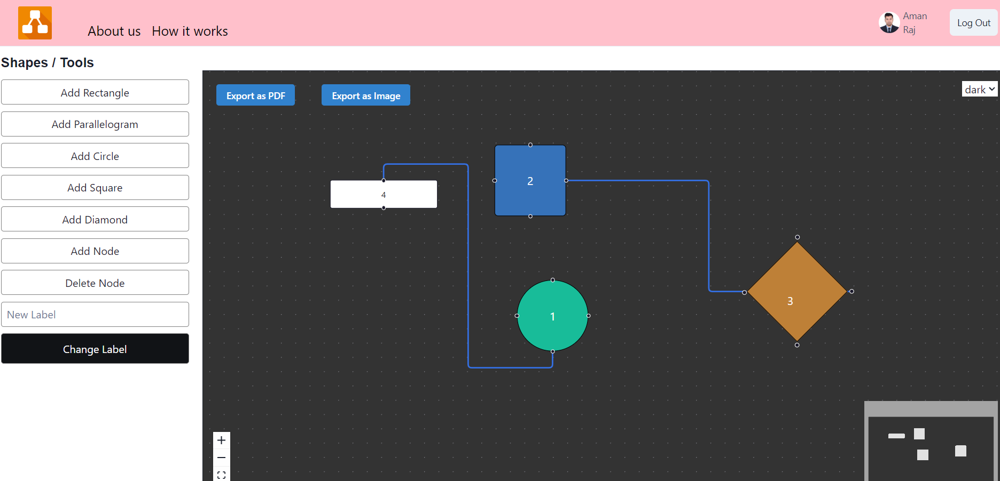
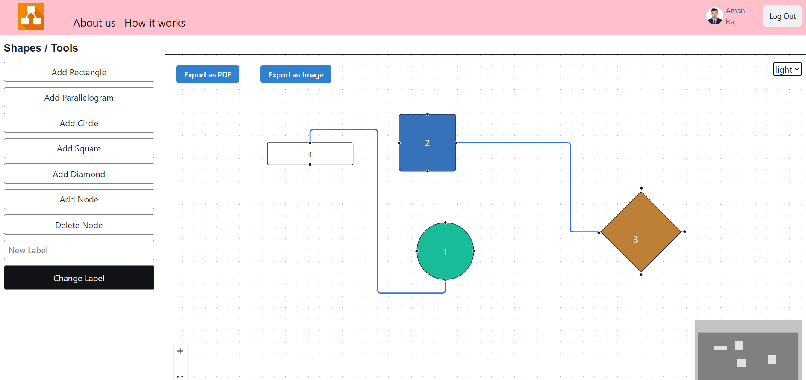
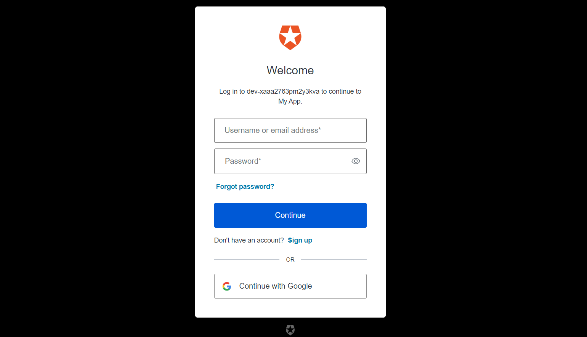

# Bit-Ballers_038

### ER Diagram Builder

### Introduction

ER diagram looks very similar to the flowchart. However, ER Diagram includes many specialized symbols, and its meanings make this model unique. The purpose of ER Diagram is to represent the logical structure & entity framework infrastructure.

### Project Type

Frontend | Backend

### Technology Stack

- Javascript
- React Js
- ChakraUi
- Autho by okta

### Deployed Link

-[Link]()

### Directory Structure


**1. Clone the repository using the bash command mentioned below.**
**2. Change the directory within "Bit-Ballers_038" using the following bash command.**

```bash
git clone (https://github.com/PKalyanReddy/Declaration-DevOps_032.git)
cd ./Bit-Ballers_038/ERDiagram_Builder__app
npm install
npm run dev
```

### Features

- **1. User Authentication: Allow users to secure login and account management, sign up, and log out.**
- **2. Diagram Creation and Editing: Users can create new ER diagrams, edit existing ones, and delete diagrams.**
- **3. Adding relationships: Add entities, attributes, and relationships (one-to-one, one-to-many, many-to-many).**
- **4. Exporting Diagrams: Export diagrams in different formats (e.g., PNG, PDF).**
- **5. Custom Template: Users can work on template diagrams and edit it.**


### Design Decisions and Assumptions

1. **Front-End Development**:
   - **ReactJS**: React & Redux for managing complex state application .
   - **ChakraUI**: Styling and responsive design for a visually appealing and user-friendly interface.

2. **Performance Considerations**:
   - Efficient data handling and minimal re-renders using Redux and React hooks.
   - Optimized for fast load times and smooth interactions.
   
3. **User Authentication**:
   - Secure login system to ensure personalized experiences and data privacy.

4. **Real-Time Updates**:
   - Real-time seat availability and booking confirmations to provide accurate and immediate feedback to users.

5. **WhiteBoard & Custom Template**:
   - Users can create new ER diagrams, edit existing ones, and delete diagrams.
   - Add node of different shapes & every shape represents different entity relationship.
   - Can connect to node using links and can remove it by on click link & backspace button.

6.  **Responsive Design**:
   - Ensuring compatibility across various devices, including desktops, tablets, and smartphones for a seamless user experience.

   ## Credentials

#### Github Repository Link
```bash
https://github.com/Kranti00/Bit-Ballers_038.git
```
### Glimpse of our project







## Project Collaborators

-Aman Raj-amanraj98523
-Aarohi singh-Aarohiparasar
-Kranti Kumar-Kranti00


